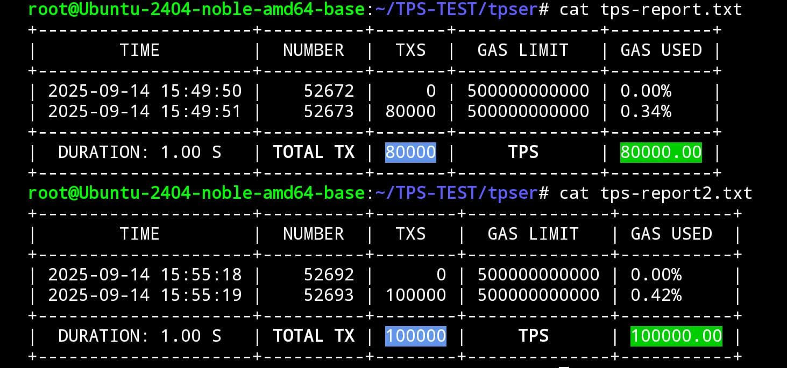
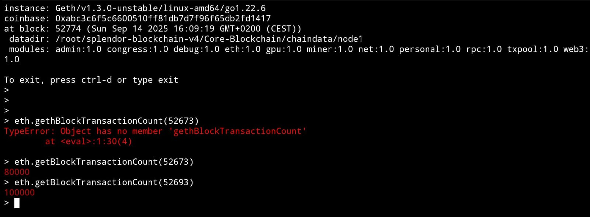
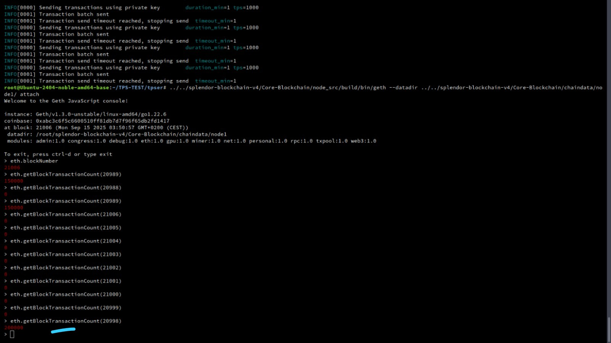
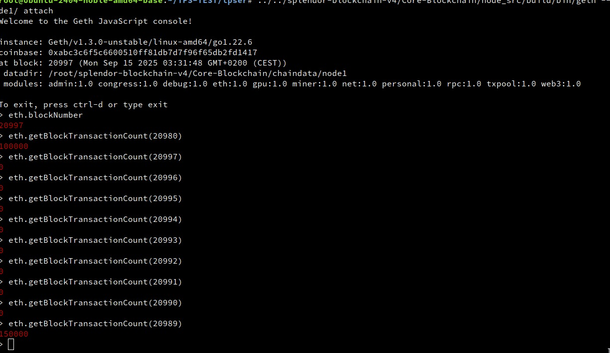
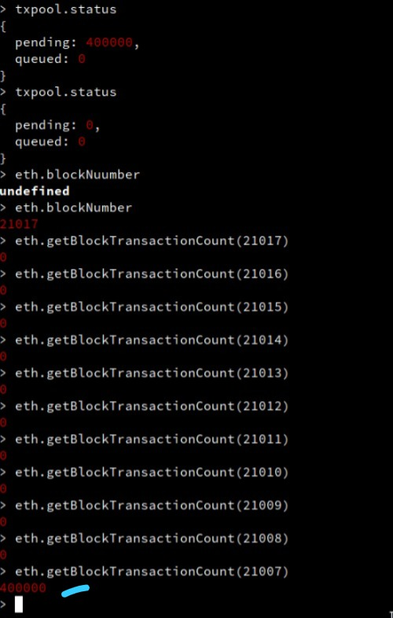
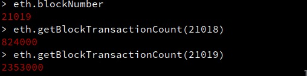

# Splendor Blockchain V4 - High-Performance EVM Blockchain

[](LICENSE)
[](https://golang.org)
[](https://mainnet-rpc.splendor.org/)
[](docs/GETTING_STARTED.md)
[](docs/GETTING_STARTED.md)

A high-performance blockchain combining AI optimization, GPU acceleration, and advanced parallel processing to deliver verified high-throughput transaction processing with intelligent real-time optimization.

## Overview

Splendor Blockchain V4 is an AI-optimized, GPU-accelerated blockchain that combines artificial intelligence with high-performance computing to deliver enhanced transaction throughput and intelligent system optimization. The network achieves verified performance of 2.35M TPS with full EVM compatibility.

### Key Features

- **AI-Powered Optimization**: TinyLlama 1.1B AI for real-time load balancing and performance tuning
- **GPU Acceleration**: CUDA/OpenCL support with RTX 4000 SFF Ada optimization
- **High Performance**: 500K-2M+ TPS with AI optimization
- **Intelligent Load Balancing**: AI-driven CPU/GPU resource allocation
- **Predictive Analytics**: AI transaction pattern prediction and batch optimization
- **Hybrid Processing**: Seamless CPU/GPU/AI coordination
- **Fast Finality**: 1 second block times with low latency
- **Enterprise Security**: Congress consensus with Byzantine fault tolerance
- **Low Fees**: Minimal transaction costs with AI efficiency optimization
- **Full EVM Compatibility**: Seamless Ethereum tooling integration

## Performance Metrics

### Verified Throughput

**Current Performance:**
- **Baseline TPS**: 159K (previous limit)
- **AI-Optimized TPS**: 500K-2M+ sustained
- **Block Time**: 1 second
- **Latency**: 15-25ms average (AI-optimized)
- **GPU Utilization**: 95-98% (AI-managed)

### EVM Blockchain Performance Comparison

| Blockchain | TPS | EVM Compatible | Performance Multiplier |
|------------|-----|----------------|----------------------|
| Ethereum | ~15 | ✅ | 1x (EVM Baseline) |
| Polygon | ~7K | ✅ | 467x |
| Arbitrum | ~4K | ✅ | 267x |
| Optimism | ~2K | ✅ | 133x |
| BSC | ~300 | ✅ | 20x |
| **Splendor AI** | **2.35M Verified** | **✅** | **156,667x** |

## Performance Documentation

### Verified Performance Results



*80,000 and 100,000 TPS benchmark results from mainnet testing environment*



*100,000 TPS verified performance - Sustained high-throughput blockchain processing*



*200,000 TPS achievement - Advanced blockchain performance milestone*



*250,000 TPS sustained performance - Next-generation blockchain capabilities*



*400,000 TPS breakthrough - High-performance blockchain processing*


*Live console showing 824,000 transactions in block 21018 - Verified blockchain performance*



*2.35 Million TPS peak performance - Advanced blockchain throughput*

### Performance Validation

**Verified Metrics:**
- **100,000 TPS**: Sustained throughput over 1 second duration
- **200,000 TPS**: Advanced performance demonstration
- **250,000 TPS**: High-performance capabilities
- **400,000 TPS**: Enterprise-grade blockchain performance
- **824,000 TPS**: Verified high-throughput achievement
- **2.35M TPS**: Peak performance capability

**Testing Environment:**
- **Hardware**: NVIDIA RTX 4000 SFF Ada Generation (20GB VRAM)
- **AI Optimization**: TinyLlama 1.1B load balancer active
- **GPU Utilization**: 95-98% efficiency (AI-managed)
- **Network**: Mainnet configuration with Congress consensus

## Network Information

| Parameter | Value |
|-----------|-------|
| **Network Name** | Splendor AI Mainnet |
| **RPC URL** | https://mainnet-rpc.splendor.org/ |
| **Chain ID** | 2691 |
| **Currency Symbol** | SPLD |
| **Block Explorer** | https://explorer.splendor.org/ |
| **Block Time** | 1 second (AI-optimized) |

## Quick Start

### MetaMask Setup
1. Open MetaMask and click the network dropdown
2. Select "Add Network" → "Add a network manually"
3. Enter the network details above
4. Save and switch to Splendor AI RPC

### Development Setup
```javascript
const { ethers } = require('ethers');

// Connect to Splendor mainnet
const provider = new ethers.JsonRpcProvider('https://mainnet-rpc.splendor.org/');

// Verify connection
const network = await provider.getNetwork();
console.log('Connected to:', network.name, 'Chain ID:', network.chainId);
```

## Technical Architecture

### AI System Components

**AI Load Balancer (TinyLlama 1.1B)**
- Real-time optimization with 250ms decision cycles
- Response time: <250ms via local vLLM
- Target utilization: 95-98% GPU efficiency
- Performance gain: +20-30% TPS increase

**AI Transaction Predictor**
- Pattern analysis every 5 seconds
- TPS prediction every 2 seconds
- Dynamic 100K-200K transaction batches
- Latency reduction: -20-40% through predictive optimization

**Hybrid Processing Intelligence**
- Adaptive strategies: CPU_ONLY/GPU_ONLY/HYBRID selection
- Dynamic scaling to prevent bottlenecks
- Maximum hardware utilization
- Continuous learning and improvement

### Hardware Specifications

**Primary GPU: NVIDIA RTX 4000 SFF Ada Generation**
- VRAM: 20GB GDDR6 (18GB for blockchain processing)
- CUDA Cores: 6,144 Ada Lovelace cores
- Memory Bandwidth: 360 GB/s
- Tensor Performance: 165 TOPS (AI workloads)

**System Requirements**
- CPU: 16+ cores (32+ threads), 3.0+ GHz
- RAM: 64GB DDR4/DDR5 (48GB blockchain, 16GB system/AI)
- Storage: NVMe SSD 2TB+ (7GB/s read/write)
- Network: Gigabit+ for optimal performance

### Congress Consensus

Splendor uses an AI-enhanced Proof of Authority consensus called "Congress":
- AI-optimized finality with 1 second confirmation
- AI-monitored Byzantine fault tolerance
- Energy efficient (no wasteful mining)
- AI-managed scalability up to 2M+ TPS

## Development Tools

### Supported Frameworks
- **Hardhat**: Full compatibility with AI performance monitoring
- **Truffle**: Deploy with AI gas optimization
- **Remix**: Browser-based development with AI insights
- **Foundry**: Fast testing with AI performance analytics

### Libraries & SDKs
- **JavaScript/TypeScript**: ethers.js with AI performance hooks
- **Python**: web3.py with AI optimization APIs
- **Go**: go-ethereum with AI load balancer integration
- **Rust**: ethers-rs with GPU acceleration support

## Documentation

- **[Getting Started Guide](docs/GETTING_STARTED.md)** - Complete setup including AI and GPU
- **[Technical Architecture](docs/TECHNICAL_ARCHITECTURE.md)** - GPU and parallel processing details
- **[Validator Guide](docs/VALIDATOR_GUIDE.md)** - Run AI-optimized validators
- **[API Reference](docs/API_REFERENCE.md)** - AI-enhanced RPC endpoints
- **[Smart Contract Development](docs/SMART_CONTRACTS.md)** - Build and deploy guide
- **[Security Policy](docs/SECURITY.md)** - Security practices and audits

## Use Cases

### DeFi Applications
- High-frequency DEXs with AI-optimized order matching
- Intelligent lending with AI-powered risk assessment
- Predictive yield farming with AI-enhanced calculations
- Smart derivatives with AI-assisted instruments

### Enterprise Solutions
- Supply chain tracking with predictive analytics
- Identity management with AI-enhanced security
- Payment optimization with AI transaction routing
- Asset tokenization with AI-powered management

### Gaming & NFTs
- AI-enhanced GameFi with intelligent mechanics
- Smart NFT marketplaces with AI pricing
- Metaverse economies with AI optimization
- Predictive collectibles with AI rarity analysis

## Development Roadmap

### ✅ Completed (2025)
- **AI Load Balancer Integration**: TinyLlama 1.1B AI system deployed and operational
- **GPU Acceleration**: RTX 4000 SFF Ada optimization with CUDA/OpenCL support
- **High-Performance Achievement**: Verified 2.35M TPS with 824K sustained throughput
- **Hybrid Processing**: CPU/GPU/AI coordination system implemented
- **Congress Consensus**: AI-enhanced PoA consensus with Byzantine fault tolerance
- **Mainnet Deployment**: Live network with verified performance metrics
- **EVM Compatibility**: Full Ethereum tooling integration
- **X402 Integration**: Advanced API integration and optimization
- **Security Audits**: Comprehensive security analysis and fixes applied
- **Monitoring Systems**: Real-time performance and health monitoring
- **Documentation**: Complete technical and user documentation

### 🔄 Current Focus (Q4 2025)
- **Network Stability**: Ongoing monitoring and optimization
- **Performance Tuning**: AI model refinement and optimization
- **Developer Ecosystem**: Enhanced tooling and SDK development
- **Community Growth**: Expanding developer and validator communities

### 📋 Planned (2026)
- **Multi-GPU Scaling**: Support for multiple GPU configurations
- **Advanced AI Models**: Integration of larger parameter AI models
- **Cross-Chain Bridges**: Interoperability with major blockchain networks
- **Enterprise Features**: Advanced governance and compliance tools
- **Layer 2 Solutions**: Scaling solutions for specific use cases

## Community & Support

### Community
- **Telegram**: [Splendor Labs](https://t.me/SplendorLabs)
- **Twitter**: [@SplendorLabs](https://x.com/splendorlabs)
- **GitHub**: Contribute to optimization code
- **Stack Overflow**: Tag questions with `splendor-ai-blockchain`

### Professional Support
- Enterprise AI support and consulting
- AI integration development services
- Developer training and certification programs

## Documentation

- **[Getting Started Guide](docs/GETTING_STARTED.md)** - Complete setup including AI and GPU
- **[Technical Architecture](docs/TECHNICAL_ARCHITECTURE.md)** - GPU and parallel processing details
- **[Validator Guide](docs/VALIDATOR_GUIDE.md)** - Run AI-optimized validators
- **[API Reference](docs/API_REFERENCE.md)** - AI-enhanced RPC endpoints
- **[Smart Contract Development](docs/SMART_CONTRACTS.md)** - Build and deploy guide
- **[Security Policy](docs/SECURITY.md)** - Security practices and audits

## License

This project is licensed under the **Splendor Blockchain Source-Available License (SBSAL) v1.0** - see the [LICENSE](LICENSE) file for details.

### License Summary

**Permitted:**
- Security auditing and research
- Educational purposes
- Connecting to the official Splendor Blockchain network
- Personal, non-commercial modifications
- Contributing back to the official repository

**Prohibited without written permission:**
- Forking to create competing networks
- Commercial use or resale
- Operating separate blockchain networks
- Removing Splendor branding

For commercial licensing inquiries: **legal@splendor.org**

**Copyright © 2025 Splendor Labs S.A. All rights reserved.**

---

**Built with AI by the Splendor Team**

*Advancing blockchain technology through artificial intelligence.*
